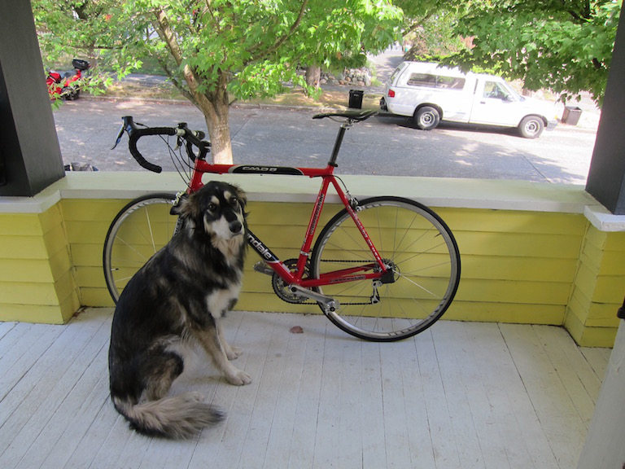
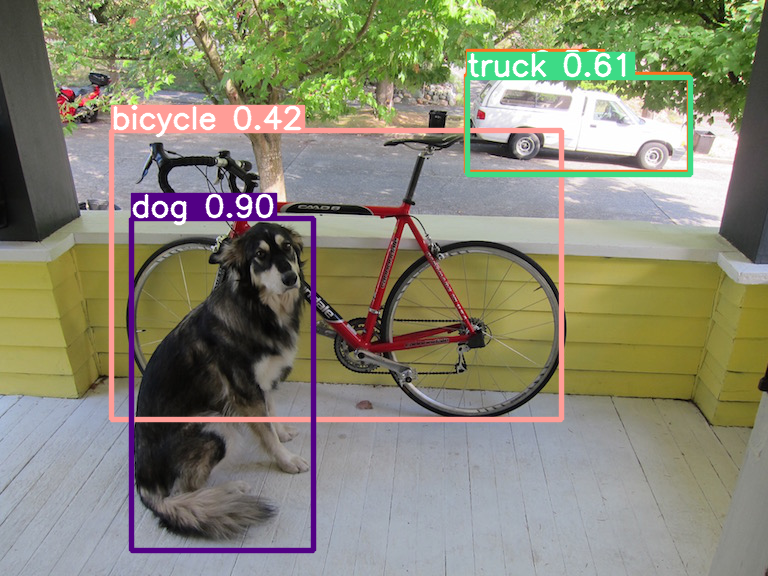

# Object Detection Based on YOLOV5

This repository provides a fast inference API to demo object detection task. 

## ONNX Model

The [./yolov5.onnx](./yolov5.onnx) is exported by official [yolov5s.pt](https://github.com/ultralytics/yolov5/releases/download/v6.0/yolov5s.pt) using [export.py](https://github.com/ultralytics/yolov5/blob/v6.0/export.py).

The model input size is (3,640,640) with NCHW + RGB format.  

Please use [netron app](https://netron.app/) to see more model details.

## Data

The testing data is located at [./data](./data) for the quick demo. 

## Prerequisites

install the required packages 

`pip3 install -r requirements`

## Usage

`python3 ./test_onnx.py`

The inference code will save the raw output tensor for debugging purposes, as well as visualized images and a text file containing labels, coordinates, and confidence scores.

## Demo Results

To test the robustness of the model, there are several testing data with different resolution put in ./data folder. 

### Input Image

## Visualized Image

## Text Info

The text file records class_name/ class_index/ xyxy coordinates/ confidence score. 

`bicycle:1 111 130 561 419 0.42154 
car:2 466 74 689 172 0.521576 
truck:7 467 77 690 174 0.609033 
dog:16 131 218 313 550 0.903322`

# Reference 

official repo: [yolov5](https://github.com/ultralytics/yolov5)

# Others

Please contact me, if you are interested in this project or have any questions.